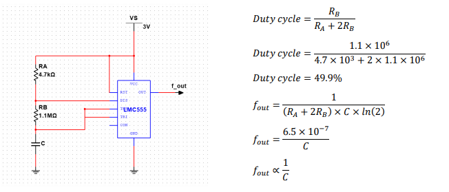
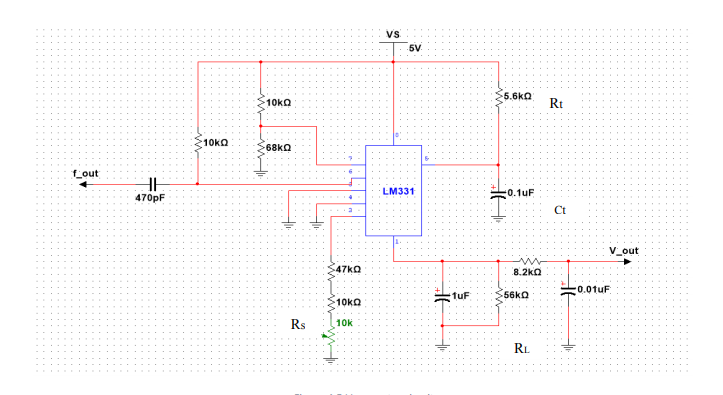
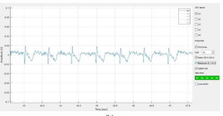
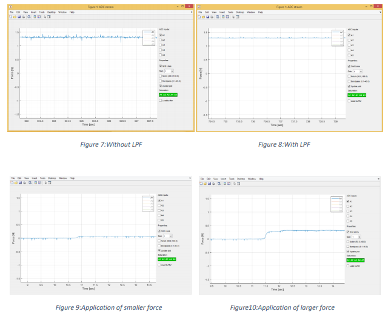
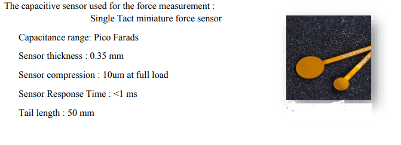

# Capacitive Force Sensor

The main objective of this project is to analyse the gait force and identify the various defects which can happen due to unproper walking patterns. we identify the relationship between the capacitance and the force, convert this variation in to a voltage and create software which can visualize live plots using MATLAB software. In this product two sensors attached to the heal and the foot. this product can also be used for posture tracking also.

## Curcuit of the product

## Results

## Characteristics of sensor used

# References
- LMC555 CMOS Timer datasheet
- https://www.electronics-tutorials.ws/waveforms/555_oscillator.html
- LM131A/LM131, LM231A/LM231, LM331A/LM331 Precision Voltage-to-Frequency Converters
Datasheet 
